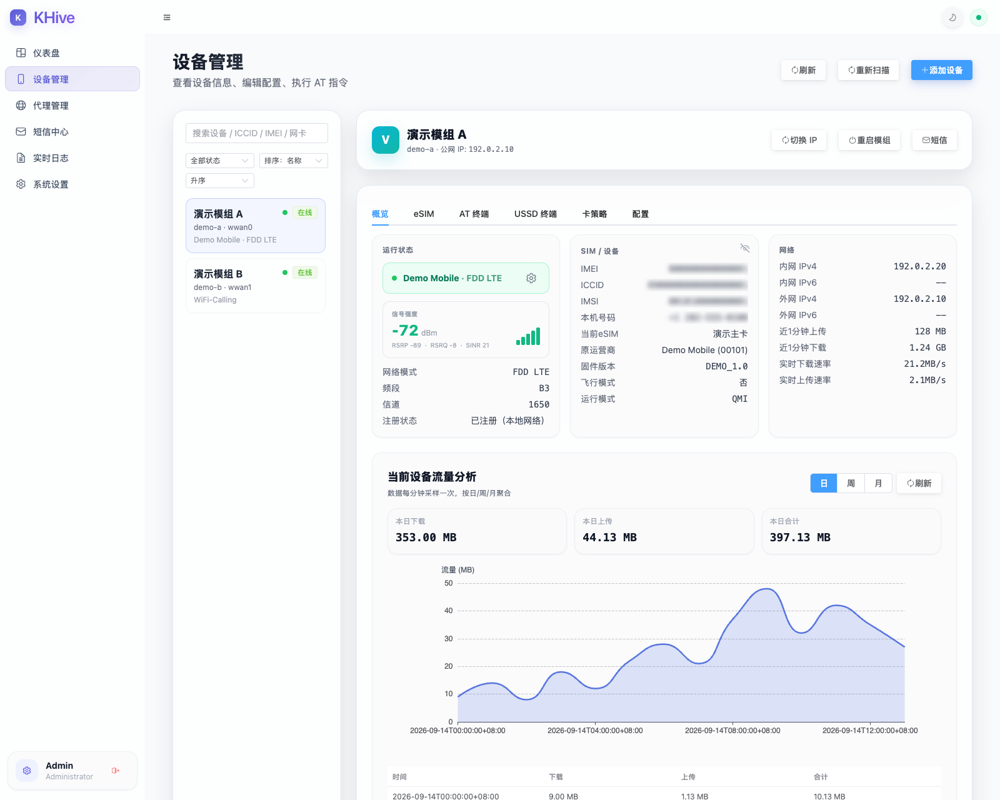
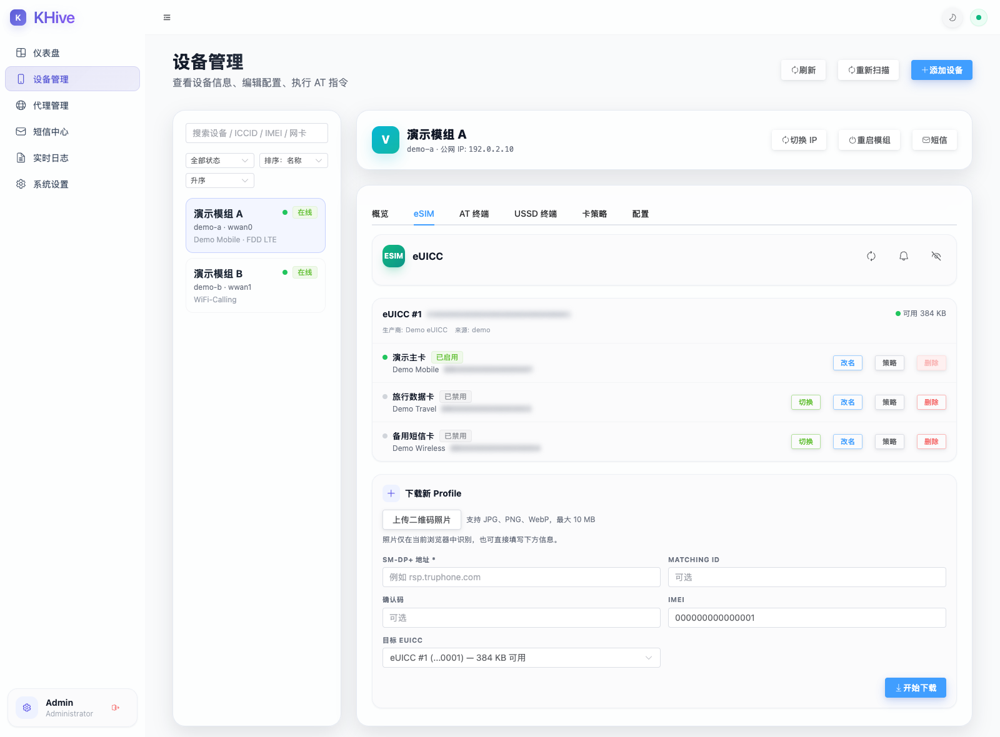
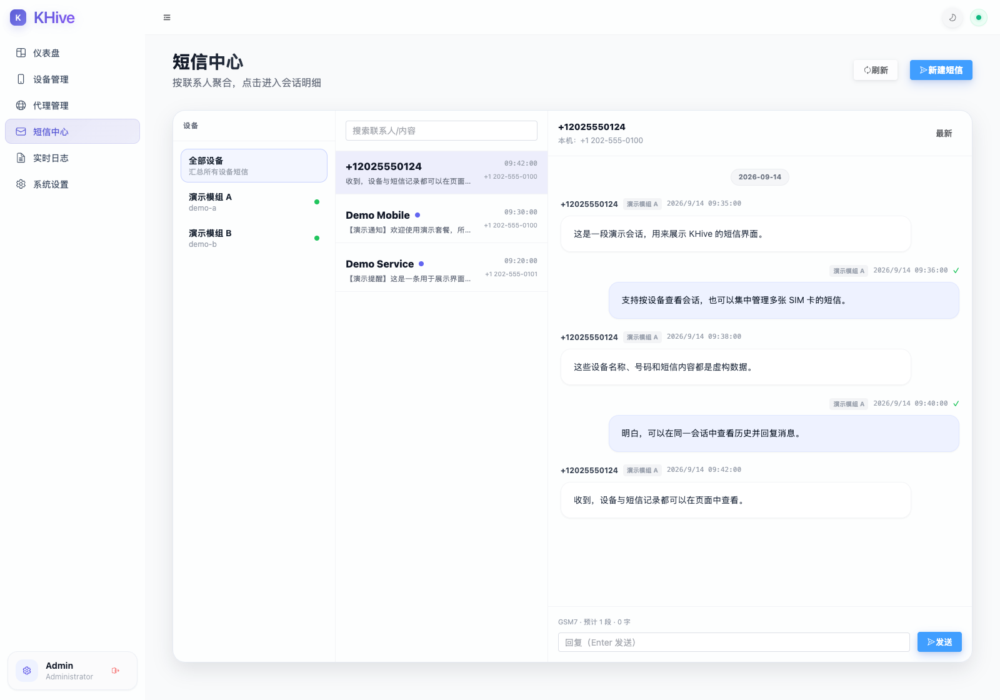

# KHive

**在一个界面中管理蜂窝模组、SIM／eSIM、短信与网络连接。**

KHive 是运行于 Linux 的蜂窝通信管理系统。它将设备状态、每卡网络策略、eSIM 管理、短信会话、VoWiFi 和消息通知整合为一套 Web 界面与 API，适合管理自有模组、搭建个人短信中心，以及研究 SIM 与蜂窝网络的协同工作。

后端使用 Go，前端使用 Vue 3，数据存储于本地 SQLite。前端资源在编译时嵌入程序，运行时无需单独启动 Node.js 服务。

## 功能

| 模块 | 能力 |
| --- | --- |
| 设备管理 | 设备发现、热插拔恢复、SIM 身份、信号、注册状态与实时概览 |
| eSIM 管理 | 多 eUICC／Profile 读取、下载、启用／停用、切换、改名、删除及通知处理 |
| 二维码导入 | 从二维码照片识别激活信息，在浏览器本地解码，确认后下载 Profile |
| 每卡策略 | 按卡保存蜂窝网络、VoWiFi、飞行模式、APN 与 IP 类型，切卡后应用对应策略 |
| 短信中心 | 收发短信、中文长短信分段与持久化重组、联系人、会话历史和发送状态 |
| VoWiFi／IMS | 经宽带网络建立运营商 IMS 短信与 USSD 通路，管理注册、保活和连接恢复 |
| USSD | 查询、交互输入与会话取消，具体能力取决于设备后端和运营商 |
| 通知 | Telegram、Webhook、Bark、Email、PushPlus、飞书和 QQ 等渠道；短信通知持久队列、退避重试与失败重排 |
| 网络与代理 | 蜂窝数据管理、SOCKS5／HTTP 代理实例、按设备网卡绑定出站及流量展示 |
| 管理接口 | 账户登录、配置管理、AT 交互、运行日志与 REST API |

切卡、下载和删除共享设备操作保护；设备会话失效后会拒绝旧操作。写卡响应不完整时应先核实卡内状态，避免重复消耗激活码。短信“已接受”或“提交已确认”不等于对方终端已送达，界面会保留未确认状态。

### 界面预览

以下截图使用 KHive 的真实界面，设备、SIM／eSIM 标识、号码、网络地址与短信内容均为虚构演示数据，不代表真实用户资料或运营商兼容性验证。

**设备管理**：集中查看模组、SIM、网络注册状态与流量信息。



**eSIM 管理**：查看卡内 Profile、启用状态与可用空间，按需切换和管理套餐。



**短信中心**：按设备组织会话，查看历史消息并回复。



## 1.0 支持范围

- **运行平台：Linux。** 当前发布基线为 Linux amd64；提供 arm64、armv7 交叉编译目标，其他架构及设备组合需自行验证。
- **设备后端：AT、QMI、MBIM。** 可用能力取决于模组接口、固件、驱动和运营商，并非所有后端支持完全相同的功能。
- **AT／ECM：** 当前支持 `cdc_ether`／`usbnet=1` 下的 IPv4 数据管理，需要 BusyBox `udhcpc`。ECM 暂不支持 IPv6 和运营商公网 IP 轮换。
- **VoWiFi：** 需要 SIM 开通相应业务、兼容的运营商认证配置及可达的 ePDG／IMS 网络。存在功能入口不代表所有运营商均已验证。
- **eSIM：** 需要支持的 eUICC 和有效激活资料。Profile 安装成功与套餐激活、漫游、联网可用是不同阶段。
- **语音通话：** 尚未纳入 1.0 的已验收能力。
- **更新方式：** 从源码编译并手动更新；当前没有自动更新源。本版本不提供 Docker 部署方案。

## 环境要求

编译需要 Git、GNU Make、Go **1.26.3 或更新版本**、Node.js **22 或更新版本**及 npm。构建过程会下载 Go 和 npm 依赖，需要访问相应软件源；依赖清单与锁文件随源码提供。

Linux 运行主机需要能够访问目标模组的 USB／串口或控制接口。网络配置、路由管理等操作还需要对应系统权限。先确认设备未被其他管理程序占用，再交给 KHive 管理。

macOS 可以交叉编译 Linux 程序；完整后端依赖 Linux 网络能力，不能作为原生 macOS 程序运行。

## 从源码编译

```sh
git clone --branch v1.0.1 --depth 1 https://github.com/kenjie-sun/KHive.git
cd KHive
make deps
make build-amd64 UPX=
```

生成文件：

```text
dist/khive_v1.0.1_linux_amd64
```

`make deps` 安装并校验 Go 依赖，使用 npm 锁文件安装前端依赖。构建会执行前端类型检查、生成页面并嵌入 Go 程序。`UPX=` 关闭可选压缩，不需要安装 UPX。

其他交叉编译目标：

```sh
make build-arm64 UPX=
make build-armv7 UPX=
```

产物分别位于 `dist/khive_v1.0.1_linux_arm64` 和 `dist/khive_v1.0.1_linux_armv7`。交叉编译成功不代表对应硬件已通过实机验收。

## 首次运行

以下命令在 **Linux 运行主机**执行，示例从源码目录开始。若在另一台机器编译，先复制与目标架构匹配的程序及示例配置。

```sh
install -d -m 700 runtime/config
install -m 755 dist/khive_v1.0.1_linux_amd64 runtime/khive
install -m 600 config/config.example.yaml runtime/config/config.yaml
cd runtime
vi config/config.yaml
```

在编辑器中将 `web.password` 的 `CHANGE_ME_BEFORE_START` 替换为独立的长随机密码。示例用户名为 `admin`；保留 `devices: []`，先通过页面发现并核对设备。

```sh
umask 077
./khive -c config/config.yaml
```

默认管理入口为 **http://127.0.0.1:8788**。在另一台电脑访问 Linux 主机时，可先建立 SSH 转发：

```sh
ssh -N -L 8788:127.0.0.1:8788 user@linux-host
```

再在本地浏览器打开相同地址。`user@linux-host` 替换为自己的 SSH 用户和主机；若改为局域网监听，请同时配置适当的访问控制。

登录后建议依次完成：

1. 在设备管理中发现并确认目标模组，再添加设备。
2. 检查当前 SIM 身份、网络注册和 eUICC 信息。
3. 为每张卡设置所需的蜂窝网络或 VoWiFi 策略。
4. 按需要配置消息通知和代理实例。
5. 下载新 Profile 时确认目标 eUICC 与激活资料；安装后核实状态，再决定是否启用。

详细配置见 [配置与使用说明](docs/CONFIGURATION.md)。

## 数据与更新

运行数据相对于程序的**工作目录**保存：

| 路径 | 内容 |
| --- | --- |
| `config/config.yaml` | 本地账户、设备和通知等配置 |
| `data/khive.db` | 短信、联系人、卡策略及其他持久化数据 |
| `data/` | 运行期缓存及相关数据文件 |
| `logs/` | 程序日志 |

服务管理器启动程序时也应设置固定工作目录。升级前停止程序并备份配置和完整数据目录，再替换已验证的新程序；保留旧程序用于回退。不要用旧数据库覆盖运行期新增数据，程序回退也不会撤销已发生的 eSIM 安装或删除。

KHive 不会自动导入其他系统的短信数据库。配置、数据库、二维码、激活码、日志和网络抓包可能含有敏感信息，请保存在本地，提交问题时只附经过脱敏的最小复现材料。

## 开发与反馈

- [版本说明](CHANGELOG.md)：当前正式版本的主要能力和兼容性说明。
- [参与贡献](CONTRIBUTING.md)：问题反馈、代码提交及隐私要求。
- [开发与检查](docs/DEVELOPMENT.md)：构建结构、前端开发及隔离回归。
- [卡策略 API](docs/CARD_POLICY_API.md)：按卡保存策略的接口说明。
- [问题反馈](https://github.com/kenjie-sun/KHive/issues)：提供版本、运行平台、模组型号／固件、设备后端、复现步骤和脱敏后的错误信息。

仓库保留源码、必要测试、锁文件、示例配置和许可证；运行数据、实机部署记录、备份及本地构建产物不属于发布内容。

## 来源与许可证

KHive 基于 [VoHive](https://github.com/1239t/vohive) 二次开发，并使用 SIP、SWu 和 eUICC 等相关组件。上游贡献、版权及第三方许可证均予保留，详见 [来源与第三方说明](docs/UPSTREAM.md)。

项目沿用 **PolyForm Noncommercial License 1.0.0**，仅限该许可证允许的非商业用途；不是 MIT／Apache 式的无限制使用许可。请在使用、修改或分发前阅读 [LICENSE](LICENSE)。KHive 与模组厂商及运营商没有官方关联。

## 相关社区

感谢 [LINUX DO](https://linux.do) 社区对开源项目的支持。
